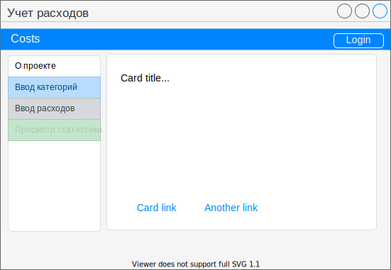

Страницы

1. Страница для неавторизованных пользователей

- о проекте
- login (в шапке)

2.  После авторизации

- logout (в шапке)
- настройка (ввод категорий и подкатегорий)
- ввод расходов
- просмотр статистики

